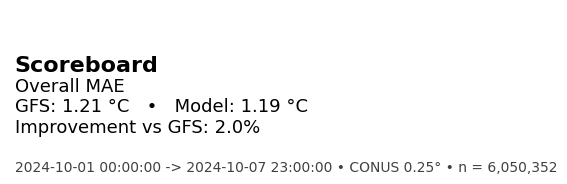
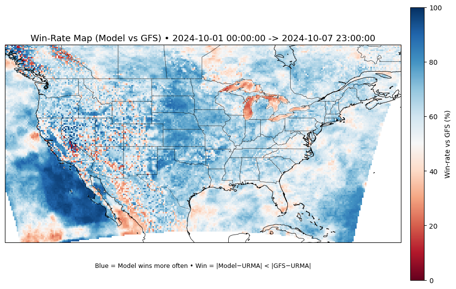
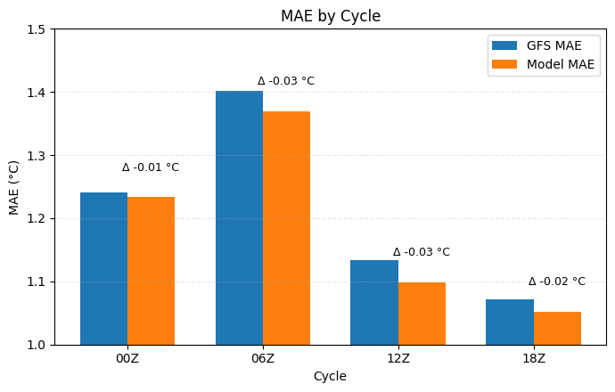
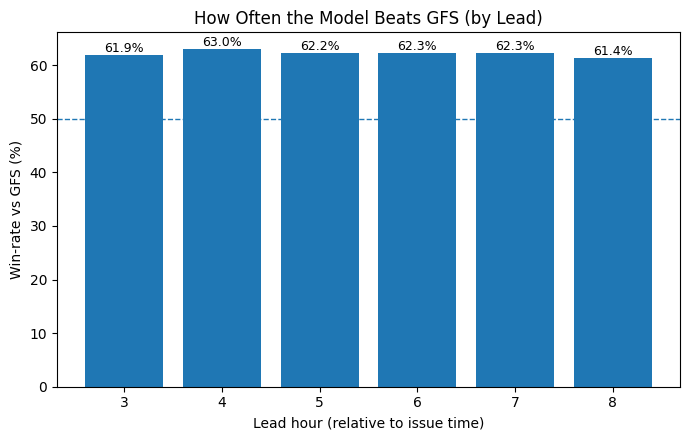

# Bias-Corrected Temperature Forecasting

An **end-to-end, online bias-correction pipeline** that

* ingests **GFS** forecasts and **URMA** analyses,
* produces short-range (lead **+3...+8 h**) 2-m temperature forecasts on the **CONUS 0.25°** grid, and
* **learns online from incoming URMA data** to correct systematic GFS errors in real time by modeling residuals on top of GFS.

This enables continuously updated, bias-corrected predictions as new truth arrives.

*Demo window:* **2024-10-01 to 2024-10-07**

The one day demo (2024-10-01) that was previously computed can be found here. ([One Day README](One_Day/README.md)).


---

## Results at a glance (1 Oct, 2024 to 7 Oct, 2024)

> The online bias-corrector beats GFS, with the strongest gains in the **3–8 h** window and clear **regional pockets** of improvement.

1. **Scoreboard (overall MAE)**
   >Model trims aggregate MAE from **1.21 to 1.19 °C** (**+2%**). Positive, consistent with other views.
   
   


2. **Spatial Win-rate Map (day aggregate)**
   > Blue = model wins more often; computed per grid cell across the day.

   > Clear **regional regimes**: broad blue zones = reliable improvement; red pockets = where GFS holds an edge.
   
   


3. **MAE by Cycle (00Z/06Z/12Z/18Z)**
   > Beats GFS in **all cycles**

   

4. **Win-rate vs GFS (by lead 3–8 h)**

   > Greater than 60% wins at every lead.

   


---

## System overview

```
Herbie (GFS/URMA)  ─┐
                    ├─► Bronze  (raw grids + ingest log)
Regrid URMA → GFS ──┤
                    ├─► Silver  (URMA on GFS grid + engineered features)
Bias MLP (online) ──┤
                    └─► Gold    (predictions, training log, daily metrics, views)
```

**Bronze:** `bronze_gfs_grid`, `bronze_urma_grid`, `bronze_ingest_log`

**Silver:** `silver_urma_on_gfs` (URMA regridded), `silver_gfs_features` (GFS + time/geo feats)

**Gold:** `predictions_grid_online`, `online_training_log`, `daily_metrics` (+ helper views)

**Block-aware timeline**

* **B0** predicts **+3,+4,+5 h**; **B1** predicts **+6,+7,+8 h**.
* As URMA lands for a block, update the model **online** (Adam + SmoothL1).
* **Canary guardrail:** if Model MAE > GFS MAE + **0.05 °C**, **rollback**.

---

## Modeling notes

* **Target:** residual learning on top of GFS (`Y = GFS + f(features)`), predict a **3-lead block** jointly.
* **Features:** local GFS temps (context & targets), lat/lon trig terms, hour-of-day & day-of-year sin/cos, cycle index.
* **Network:** MLP (64×2, dropout 0.1), sized for fast online updates.
* **Scaler:** streaming Welford variance; persisted to JSON.
* **Why blocks?** Low-latency predictions for the next 3 h while truth for the previous block arrives means **tight feedback, safer updates**.

---

## Ops sanity & data quality

* **Completion:** per-cycle `b0_done/b1_done` and cycle/blocks-done tallies.
* **Lead health:** 5% per-lead row-count deviation alert.
* **Nulls/dupes:** explicit scans; merges are keyed/idempotent.
* **Coverage:** URMA regridded to the GFS CONUS grid (consistent truth).
* **Ingest log:** per asset/hour status (`started/success/skip/failed`) for audit.

---

## Limitations & next steps

* **Scope:** One-day demo; extend to weeks/months for stable skill and regime analysis.
* **Features:** add **terrain/elevation, land-use, coastal distance, dT/dt**, cloud/radiation proxies.
* **Modeling:** try **cycle/region-aware heads** or mixture-of-experts; add **uncertainty (quantiles)**.

---

### Glossary

* **URMA:** Unrestricted Mesoscale Analysis (verification truth).
* **Lead hour:** Forecast hour relative to cycle time.
* **Canary:** Quick verification that gates model updates (with rollback).
* **Win-rate:** % of points where **|Model−Obs| < |GFS−Obs|**.

